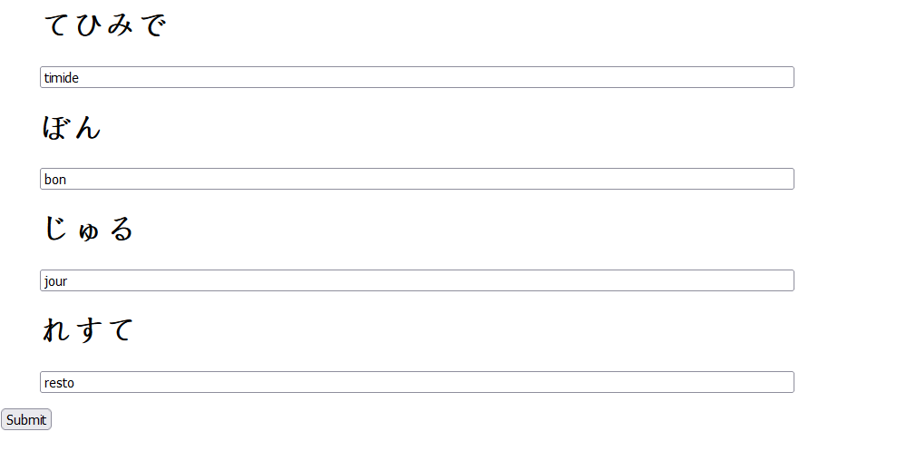
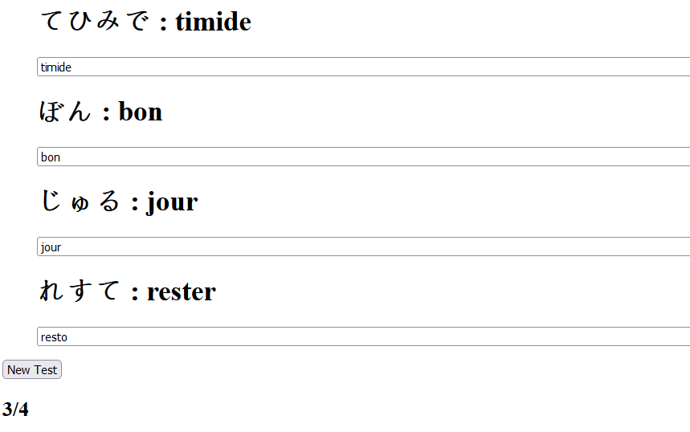
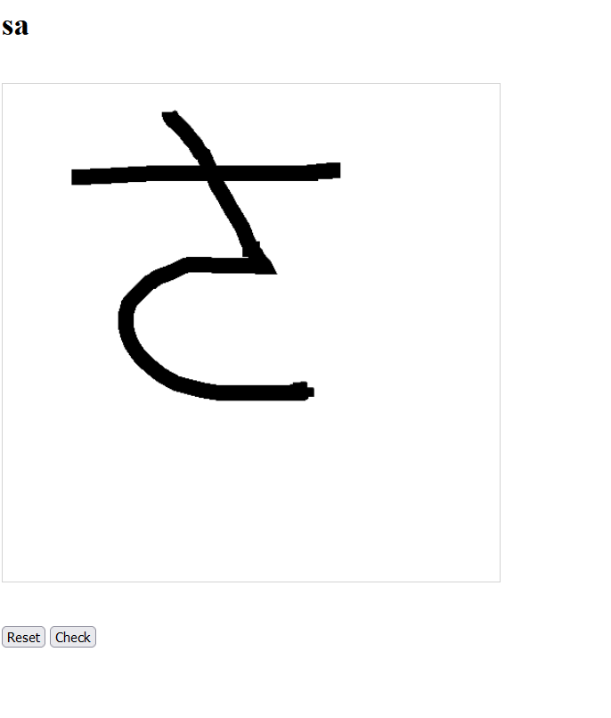
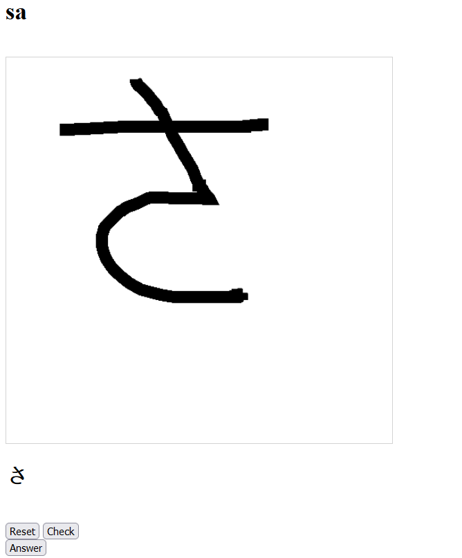
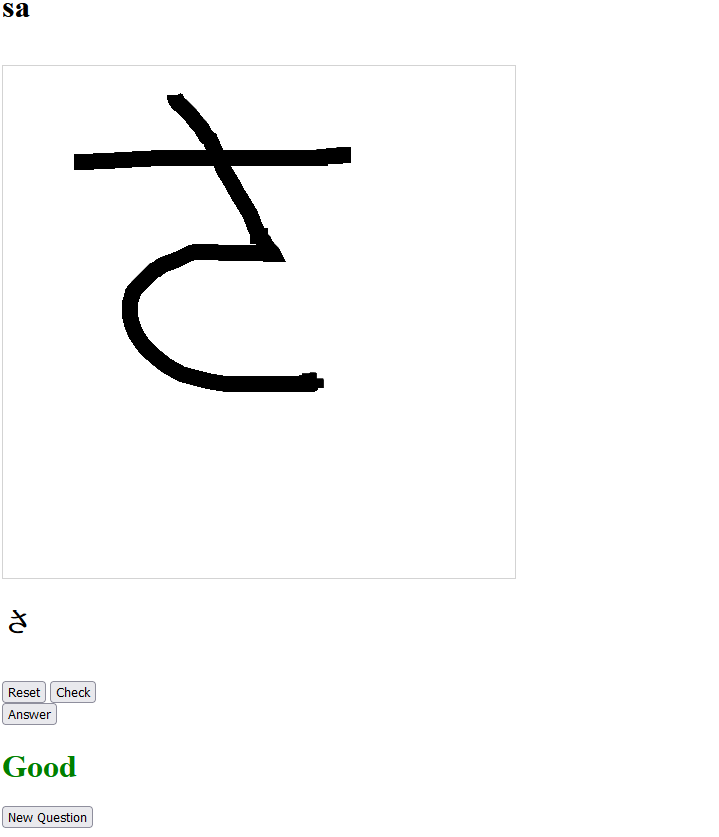

# japanese_learner_site

## japanese2latin

You have a list of words written with Hiragana, and you have to find the original word.

Fill the input under the words :



And next press the Submit button. The good answers will be displayed next to the hiragana words and the result will be shown at the bottom.



Click on the "New Test" button or refresh the page to have the next question


## latin2japanese

You have a Hiragana in Latin letters, and you have to draw the corresponding Hiragana. If you made a mistake, click on the reset button to clean the canvas.



Once you draw the letter, click on the check button to see the letter that was detected. If the letter is not the expected one, redraw it.




Once you have your expected letter, click on Answer to see if you had the good answer.



Click on the "New Question" button or refresh the page to have the next question

## Init data

run generate_datasets.py at the base of the project :

```
generate_datasets.py
```

and then run :

```
python manage.py loaddata japanese2latin/data_init.json
python manage.py loaddata latin2japanese/data_init.json
```

in japanese_learner_site/ folder


